# Discord Bot Setup Tutorial

After reading this tutorial, you would know:
* How to set up a Discord bot
* How to get your Discord bot token
* How to invite your Discord bot to Discord servers

#### Step 1 - Sign in your discord

And open the [Discord developer portal(https://discord.com/developers/applications)](https://discord.com/developers/applications) in your browser. 

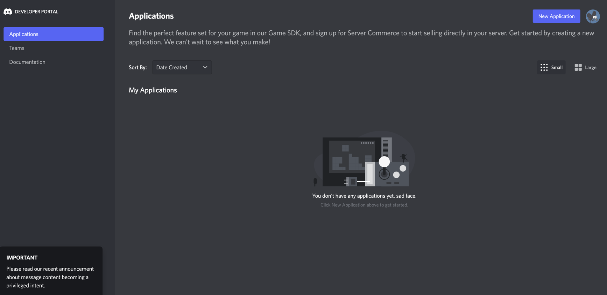

You would see a page like that. 

#### Step 2 - Click on the top right ```New Application``` button

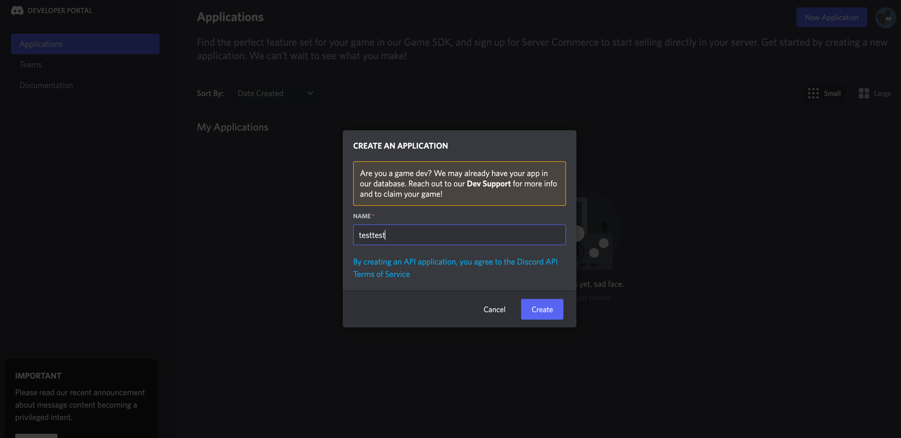

And then put a name inside the input field. 

Then you would be navigated to this page: 

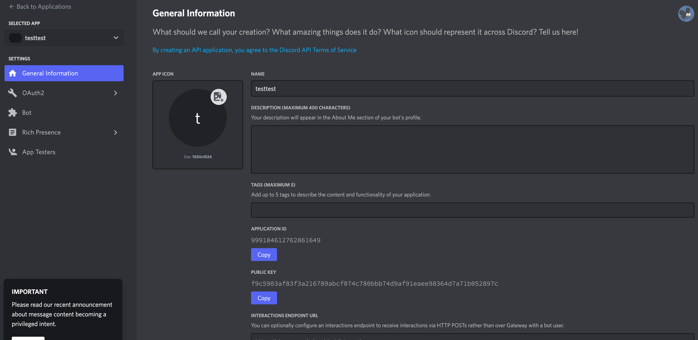

#### Step 3 - Click on ```Bot``` button at the left menu

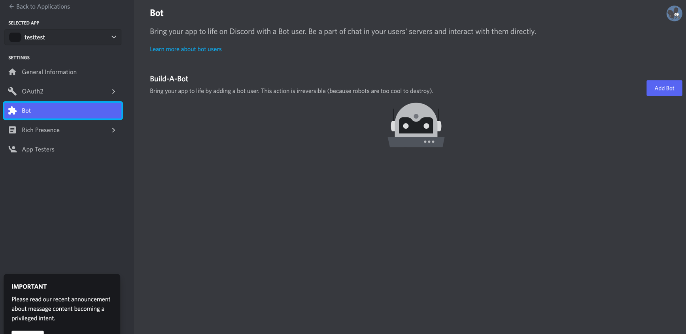

Then click on ```Add Bot``` at the right. 

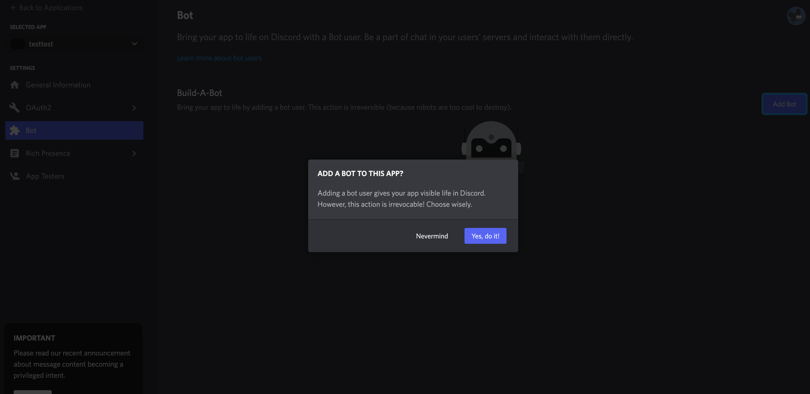

Confirm ```Yes, do it!```, then

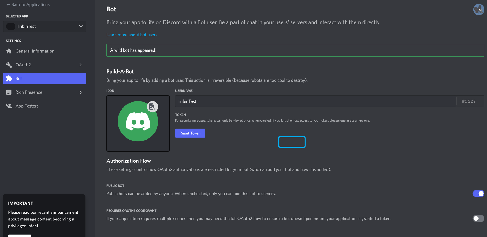

You would see this page. 

#### Step 4 - Click on ```Reset Token```

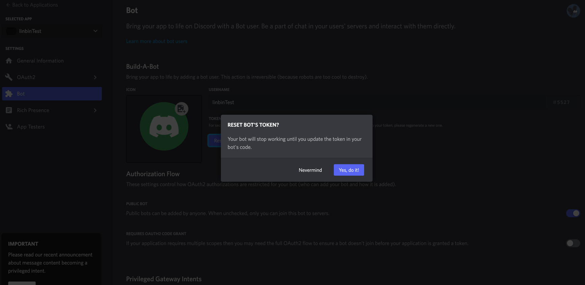

Then Confirm it ```Yes, do it!```

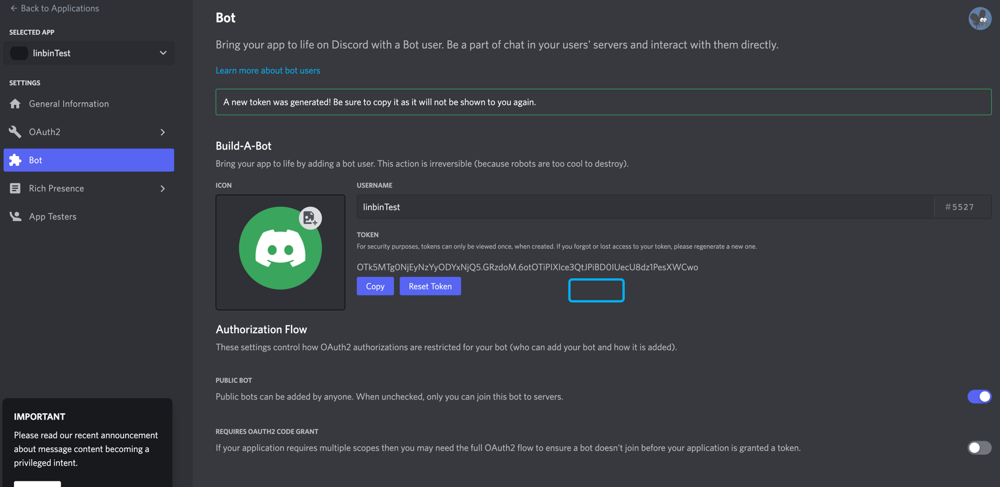

You would see your Discord bot token right there. 

Remember to keep your token save; it is just like the password of your bot. 

#### Step 5 - Scroll down a little bit

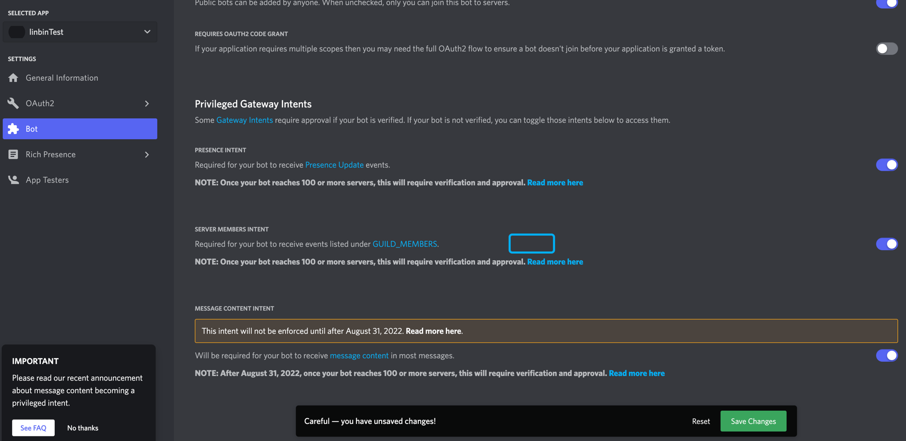

Check for all the ```PRESENCE INTENT```, ```SERVER MEMBERS INTENT```, and ```MESSAGE CONTENT INTENT``` checkboxes. 

Then click ```Save Changes```


#### Step 6 - Click on ```OAuth2``` in the left menu

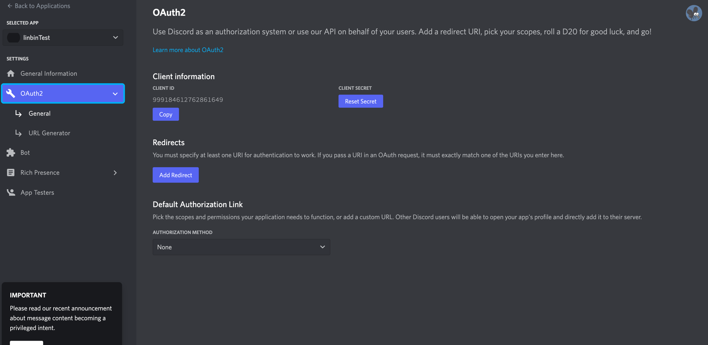

Click on ```URL Generator```

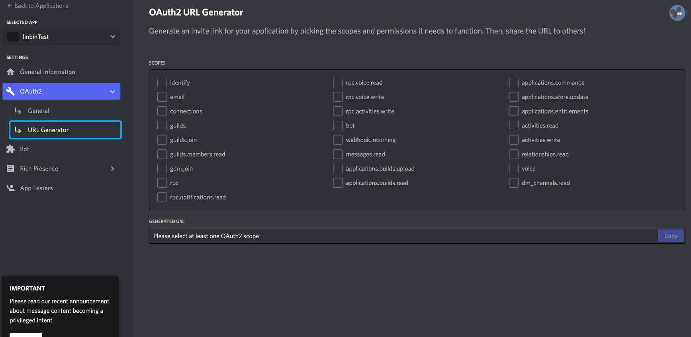

Check the checkboxes of ```bot```, ```applications.commands```
Then check for the checkbox of ```Administrator```

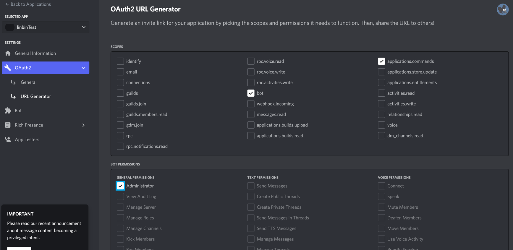

Scroll down a little, then you would see your bot URL. 

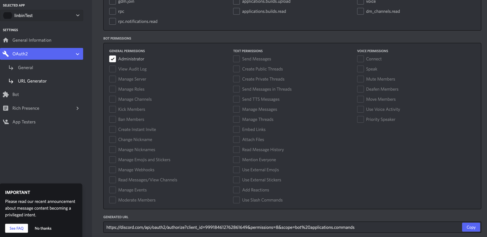

This URL is your bot invite URL. 

#### Step 7 - Final

Copy your bot invite URL, and open it in your browser. 

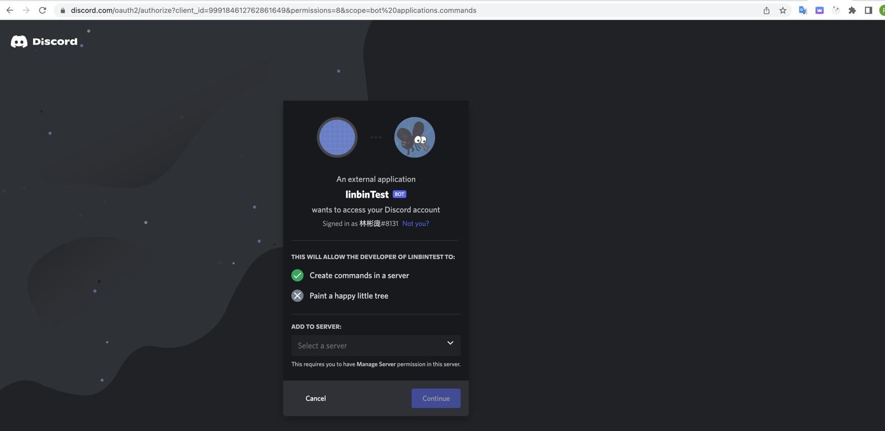

Then, you can invite this bot to your Discord server. 

Also, you could share this link to your friends, and they could invite your bot to their servers. 

Now, you can use this Discord token to start your bot. 
